# 🏦 Data Reconciliation Deep Agents Demo

[](https://python.org)
[](https://github.com/deepagents/deepagents)
[](https://openai.com)
[](LICENSE)

> **An AI-powered financial reconciliation system that automatically matches bank statements with ledger entries using intelligent pattern recognition and fuzzy matching algorithms.**

## 📋 Table of Contents

- [🎯 Overview](#-overview)
- [✨ Key Features](#-key-features)
- [🏗️ System Architecture](#️-system-architecture)
- [🔄 Workflow Pipeline](#-workflow-pipeline)
- [🧠 AI Agent Intelligence](#-ai-agent-intelligence)
- [📊 Reconciliation Strategies](#-reconciliation-strategies)
- [🚀 Quick Start](#-quick-start)
- [📁 Project Structure](#-project-structure)
- [🔧 Configuration](#-configuration)
- [📈 Sample Data & Test Cases](#-sample-data--test-cases)
- [🎯 Use Cases](#-use-cases)
- [🤝 Contributing](#-contributing)
- [👨‍💻 Author](#-author)

## 🎯 Overview

This project demonstrates an advanced **AI-powered data reconciliation system** that solves one of the most challenging problems in financial operations: automatically matching transactions between different financial systems (bank statements vs. internal ledgers).

### 🎪 The Challenge

Real-world financial reconciliation involves:
- **Format Variations**: Different CSV structures, date formats, and column names
- **Timing Differences**: Bank clearing delays (1-5 business days)
- **Amount Discrepancies**: Payment processor fees (Stripe, PayPal) causing net vs. gross mismatches
- **Description Noise**: Bank statements with cryptic merchant codes vs. clean ledger descriptions
- **Many-to-One Relationships**: Payroll batches, invoice consolidations
- **Outstanding Items**: Uncleared checks, pending transactions

### 🧠 The Solution

Our system combines:
1. **🤖 AI Agent Intelligence** - Uses DeepAgents framework with GPT-4o for intelligent data processing
2. **📊 Deterministic Matching Engine** - Implements multiple reconciliation strategies
3. **🔄 Automated Normalization** - Converts any CSV format to standardized schema
4. **📈 Comprehensive Reporting** - Generates detailed Excel reports with match quality indicators

## ✨ Key Features

### 🎯 Core Capabilities
- **🔍 Intelligent Pattern Recognition** - AI identifies transaction patterns across different formats
- **⚡ Multi-Strategy Matching** - Exact, fuzzy, and fee-adjusted matching algorithms
- **📅 Date Tolerance Handling** - Accounts for business day clearing delays
- **💰 Amount Normalization** - Handles sign conventions and absolute value matching
- **📊 Comprehensive Reporting** - Detailed Excel output with match quality metrics

### 🛠️ Technical Features
- **🔧 Format Agnostic** - Processes any CSV/Excel format automatically
- **🎨 Real-time Streaming** - Live progress updates during processing
- **🛡️ Error Resilience** - Robust error handling and recovery
- **📈 Scalable Architecture** - Handles large datasets efficiently
- **🔒 Secure Processing** - Local file processing, no data transmission

## 🏗️ System Architecture


## 🔄 Workflow Pipeline

### Phase 1: Data Ingestion & Analysis


### Phase 2: Normalization Process


### Phase 3: Reconciliation Matching

```mermaid
graph TD
    A[Normalized Data] --> B[Strategy 1: Exact Match]
    A --> C[Strategy 2: Fee Match]
    A --> D[Strategy 3: Fuzzy Match]
    
    B --> E{Date Within 5 Days?}
    C --> F{96-99% Amount Match?}
    D --> G{Similarity Threshold?}
    
    E -->|Yes| H[✅ Exact Match]
    E -->|No| I[❌ Skip]
    
    F -->|Yes| J[✅ Fee Match]
    F -->|No| I
    
    G -->|Yes| K[✅ Fuzzy Match]
    G -->|No| L[❓ Unmatched]
    
    H --> M[Final Report]
    J --> M
    K --> M
    L --> M
```


## 🧠 AI Agent Intelligence

### 🎯 Agent Capabilities

The AI agent is powered by **DeepAgents framework** and **GPT-4o**, providing:

#### 📊 Intelligent Data Analysis
- **Format Recognition**: Automatically identifies CSV structures and column meanings
- **Pattern Detection**: Recognizes transaction patterns and relationships
- **Context Understanding**: Interprets business logic behind financial data

#### 🔧 Adaptive Processing
- **Dynamic Schema Mapping**: Maps any input format to standardized schema
- **Error Recovery**: Handles malformed data and missing fields gracefully
- **Real-time Decision Making**: Adjusts processing strategy based on data characteristics

#### 💡 Business Logic Integration
- **Financial Domain Knowledge**: Understands accounting principles and reconciliation rules
- **Industry Standards**: Applies common financial reconciliation practices
- **Custom Rule Application**: Adapts to specific business requirements

### 🛠️ Technical Implementation

```python
# Core AI Agent Configuration
agent = create_deep_agent(
    model=ChatOpenAI(model="gpt-4o", temperature=0),
    tools=[python_tool, inspect_file],
    backend=FilesystemBackend(),
    system_prompt=skills_prompt
)

# Streaming Processing with Real-time Updates
for chunk in agent.stream({"messages": [("user", query)]}):
    if "agent" in chunk:
        print(f"🤖 AGENT: {chunk['agent']['messages'][0].content}")
    elif "tools" in chunk:
        print(f"⚙️ TOOL: {chunk['tools']['messages'][0].name}")
```

## 📊 Reconciliation Strategies

### 1. 🎯 Exact Match Strategy
**Purpose**: Identifies perfect matches between bank and ledger transactions

**Algorithm**:
- Compares absolute values to handle sign differences
- Applies 5-day date tolerance for clearing delays
- Matches within ±$0.01 precision

```python
# Exact matching with absolute values
df_l['abs_amt'] = df_l['std_amt'].abs()
df_b['abs_amt'] = df_b['std_amt'].abs()

exact_matches = candidates[np.isclose(candidates['abs_amt'], row_l['abs_amt'], atol=0.01)]
```

### 2. 💳 Fee Match Strategy (Stripe/PayPal)
**Purpose**: Handles payment processor fee deductions

**Algorithm**:
- Identifies transactions where bank amount is 96-99% of ledger amount
- Accounts for typical payment processor fees (2.9% + $0.30)
- Calculates and reports fee differences

```python
# Fee matching for payment processors
fee_candidates = candidates[
    (candidates['abs_amt'] < row_l['abs_amt']) & 
    (candidates['abs_amt'] > row_l['abs_amt'] * 0.96)
]
```

### 3. 🔍 Fuzzy Match Strategy
**Purpose**: Matches transactions with similar but not identical amounts

**Algorithm**:
- Uses similarity thresholds for amount matching
- Considers description similarity
- Applies weighted scoring for match confidence

### 4. 📅 Date Tolerance Logic
**Purpose**: Accounts for banking clearing delays

**Features**:
- 5-day tolerance window
- Business day awareness
- Weekend and holiday considerations

## 🚀 Quick Start

### Prerequisites
```bash
# Required Python packages
pip install pandas numpy deepagents langchain-openai python-dotenv openpyxl
```

### Environment Setup
```bash
# Create .env file
echo "OPENAI_API_KEY=your_openai_api_key_here" > .env
```

### Basic Usage

#### 1. 🎲 Generate Sample Data
```bash
python dummy_data.py
```
This creates realistic test data with common reconciliation challenges:
- **Stripe Fee Scenario**: $1,250 ledger entry vs $1,213.45 bank deposit
- **Payroll Batch**: 3 salary entries vs 1 bank withdrawal
- **Outstanding Check**: Ledger entry with no bank match
- **Ghost Subscription**: Bank charge with no ledger entry

#### 2. 🚀 Run Reconciliation
```bash
# Using default files
python deepagent.py

# Using custom files
python deepagent.py bank_statement.csv ledger_export.csv
```

#### 3. 📊 Review Results
The system generates `Reconciliation_Report.xlsx` with:
- **Exact Matches**: Perfect transaction pairs
- **Partial Matches**: Fee-adjusted matches with difference amounts
- **Unmatched Bank**: Bank transactions without ledger pairs
- **Unmatched Ledger**: Ledger entries without bank pairs

### Sample Output
```
🚀 System Online.
📝 Task: Reconcile 'bank_statement_real.csv' and 'ledger_export_real.csv'.
------------------------------------------------------------
🤖 AGENT: I'll analyze the files and perform reconciliation...
⚙️ TOOL: python_interpreter
   ↳ Loading bank_statement_real.csv...
   ↳ Loading ledger_export_real.csv...
   ↳ Normalizing data formats...
   ↳ Running reconciliation engine...
SUCCESS: Report generated at Reconciliation_Report.xlsx with 23 rows.
```

## 📁 Project Structure

```
data_reconciliation_deepagents_demo/
├── 📄 README.md                    # This comprehensive guide
├── 🤖 deepagent.py                 # Main AI agent and reconciliation engine
├── 🎲 dummy_data.py                # Realistic test data generator
├── 📋 SKILLS.md                    # AI agent instructions and protocols
├── 📊 bank_statement_real.csv      # Sample bank statement data
├── 📊 ledger_export_real.csv       # Sample ledger export data
├── 📊 temp_norm_bank.csv           # Normalized bank data (generated)
├── 📊 temp_norm_ledger.csv         # Normalized ledger data (generated)
└── 📈 Reconciliation_Report.xlsx   # Final reconciliation report (generated)
```

### 📄 File Descriptions

| File | Purpose | Key Features |
|------|---------|--------------|
| `deepagent.py` | Core system engine | AI agent, reconciliation algorithms, streaming interface |
| `dummy_data.py` | Test data generator | Realistic scenarios, edge cases, business logic simulation |
| `SKILLS.md` | AI instructions | Data normalization protocol, transformation rules |
| Sample CSVs | Test datasets | Real-world format variations, common reconciliation challenges |

## 🔧 Configuration

### 🎛️ System Parameters

```python
# Reconciliation tolerances
DATE_TOLERANCE_DAYS = 5        # Business day clearing window
AMOUNT_PRECISION = 0.01        # Dollar cent precision
FEE_MATCH_THRESHOLD = 0.96     # 96% minimum for fee matches

# AI Model settings
MODEL = "gpt-4o"               # OpenAI model version
TEMPERATURE = 0                # Deterministic responses
```

### 🔧 Customization Options

#### Custom Matching Rules
```python
# Add custom matching strategies
def custom_match_strategy(df_ledger, df_bank):
    # Implement business-specific logic
    pass
```

#### Format Adapters
```python
# Support additional file formats
def process_quickbooks_export(filepath):
    # Custom QuickBooks format handler
    pass
```

## 📈 Sample Data & Test Cases

### 🎯 Realistic Test Scenarios

Our `dummy_data.py` generates comprehensive test cases that mirror real-world challenges:

#### 1. 💳 **The Stripe Trap**
- **Scenario**: Payment processor fee deduction
- **Ledger**: $1,250.00 (gross sale)
- **Bank**: $1,213.45 (net after 2.9% + $0.30 fee)
- **Challenge**: AI must recognize fee-adjusted match

#### 2. 💰 **Payroll Batch Processing**
- **Scenario**: Multiple salary entries vs single bank withdrawal
- **Ledger**: 3 separate salary entries ($4,500 + $4,200 + $3,800)
- **Bank**: 1 payroll provider withdrawal ($12,500)
- **Challenge**: Many-to-one relationship matching

#### 3. ✉️ **Outstanding Check**
- **Scenario**: Mailed check not yet cleared
- **Ledger**: Check payment entry ($1,500)
- **Bank**: No corresponding entry
- **Challenge**: Distinguish from errors vs. timing differences

#### 4. 👻 **Ghost Subscription**
- **Scenario**: Forgotten recurring charge
- **Ledger**: No entry
- **Bank**: Subscription charge ($30)
- **Challenge**: Flag as unmatched for investigation

#### 5. 🏢 **Standard Business Transactions**
- **Scenario**: Regular vendor payments with format variations
- **Ledger**: Clean descriptions ("Slack Expense")
- **Bank**: Noisy descriptions ("POS DEBIT SLACK TECHNOLOGIES CA 4402")
- **Challenge**: Pattern recognition across format differences

### 📊 Data Statistics

| Metric | Value | Description |
|--------|-------|-------------|
| Total Transactions | 38 | Combined bank and ledger entries |
| Exact Matches | ~15 | Perfect amount and date matches |
| Fee Matches | 1 | Stripe payment processor scenario |
| Unmatched Items | ~5 | Outstanding checks and ghost transactions |
| Date Range | Jan 2025 | 31-day reconciliation period |

## 🎯 Use Cases

### 🏢 **Enterprise Applications**
- **Monthly Bank Reconciliation**: Automate month-end closing processes
- **Multi-Entity Consolidation**: Reconcile across multiple bank accounts
- **Audit Preparation**: Generate detailed match documentation
- **Exception Management**: Identify and investigate unmatched items

### 🏪 **Small Business Solutions**
- **QuickBooks Integration**: Process exported transaction data
- **E-commerce Reconciliation**: Handle PayPal, Stripe, Square transactions
- **Cash Flow Management**: Identify timing differences and outstanding items
- **Tax Preparation**: Ensure complete transaction matching

### 🏦 **Financial Services**
- **Client Reconciliation**: Match client statements with internal records
- **Regulatory Reporting**: Ensure transaction completeness
- **Risk Management**: Identify discrepancies and control gaps
- **Process Automation**: Reduce manual reconciliation effort

### 🔬 **Research & Development**
- **Algorithm Testing**: Benchmark matching strategies
- **Data Quality Assessment**: Evaluate transaction data integrity
- **Process Optimization**: Identify reconciliation bottlenecks
- **AI Model Training**: Generate labeled datasets for ML models

## 🤝 Contributing

We welcome contributions to improve the reconciliation system! Here's how you can help:

### 🐛 **Bug Reports**
- Use GitHub Issues to report bugs
- Include sample data and error messages
- Describe expected vs. actual behavior

### 💡 **Feature Requests**
- Suggest new matching strategies
- Propose additional file format support
- Request integration capabilities

### 🔧 **Code Contributions**
1. Fork the repository
2. Create a feature branch
3. Implement your changes
4. Add tests and documentation
5. Submit a pull request

### 📚 **Documentation**
- Improve README sections
- Add usage examples
- Create tutorial content
- Translate documentation

## 👨‍💻 Author

**Sahil Ranmbail**
- 🔗 GitHub: [@sahilranmbail](https://github.com/SahiL911999)
- 📧 Email: sahil.ranmbail@gmail.com
- 💼 LinkedIn: [Sahil Ranmbail](https://linkedin.com/in/sahil-ranmbail)

### 🙏 Acknowledgments

Special thanks to:
- **DeepAgents Team** for the powerful AI framework
- **OpenAI** for GPT-4o model capabilities
- **Pandas Community** for excellent data processing tools
- **Open Source Contributors** who make projects like this possible

---

## 📄 License

This project is licensed under the MIT License - see the [LICENSE](LICENSE) file for details.

## 🔗 Links

- 📚 [DeepAgents Documentation](https://github.com/deepagents/deepagents)
- 🤖 [OpenAI API Documentation](https://platform.openai.com/docs)
- 🐼 [Pandas Documentation](https://pandas.pydata.org/docs/)
- 🔧 [LangChain Documentation](https://python.langchain.com/docs/)

---

<div align="center">

**⭐ If this project helped you, please give it a star! ⭐**

*Built with ❤️ using AI and modern Python technologies*

</div>